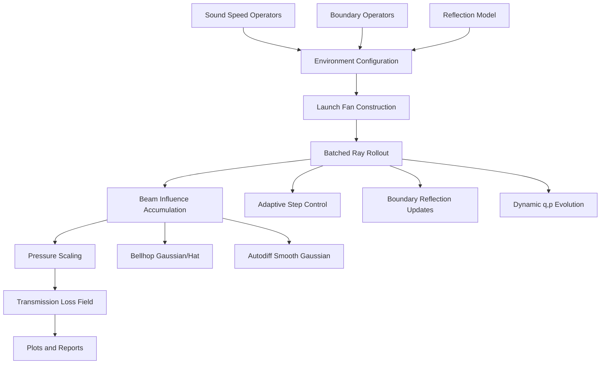

# Solver Architecture

This document explains the purpose, design, and implementation of the JAX underwater acoustic solver in this repository.

## Purpose

The repository supports two closely related goals:

- Bellhop-oriented validation against established underwater acoustics benchmark cases.
- differentiable SciML workflows, where transmission loss or pressure fields must remain compatible with JAX autodiff.

Those goals are related, but not identical. Bellhop parity tends to prefer discrete event logic and beam rules, while SciML optimization prefers smooth, stable differentiable operators. The code therefore exposes two solver paths built on a shared batched ray tracer.

## Main Modules

- `src/simulation/dynamic_ray_tracing.py`
  Core ray tracing, dynamic ray equations, field accumulation, and TL solvers.
- `src/simulation/sound_speed.py`
  Sound-speed profile definitions and derivative operators.
- `src/simulation/boundary.py`
  Bathymetry, altimetry, normals, tangents, and boundary sampling support.
- `src/plot.py`
  Environment and TL plotting helpers, including Bellhop-style `plotshd` rendering rules.
- `validation/run_benchmarks.py`
  Bellhop-vs-JAX benchmark orchestration and report generation.

## High-Level Data Flow



## Solver Entry Points

### `solve_transmission_loss(...)`

Use this path for Bellhop-style validation and fidelity studies.

Properties:

- supports coherent, incoherent, and semi-coherent run modes
- supports Bellhop-style Gaussian and hat influence options
- uses batched ray tracing with boundary logic and beam accumulation
- intended for comparison with Bellhop benchmark outputs

### `solve_transmission_loss_autodiff(...)`

Use this path for differentiable optimization and inverse problems.

Properties:

- uses smooth receiver-grid accumulation
- avoids hard receiver bracketing and receiver masking
- designed to remain compatible with `jax.jit`, `jax.vmap`, and `jax.grad`

## Implementation Strategy

### 1. Acoustic Environment Configuration

The solver is configured through `configure_acoustic_operators(...)`.

This installs:

- sound-speed operators: `c`, `c_r`, `c_z`, `c_rr`, `c_rz`, `c_zz`
- boundary samplers: bathymetry and altimetry
- geometric boundary operators: normals and tangents
- reflection and step-control runtime configuration

This design keeps the numerical kernels lightweight while still allowing benchmark cases to replace the environment cleanly.

### 2. Batched Ray Tracing

The tracer evolves all rays together as batched JAX arrays rather than looping over rays in Python.

Core ideas:

- ray states are stored in contiguous batched tensors
- propagation uses `jax.lax.scan`
- boundary logic uses masking and `jnp.where`
- terminated rays are frozen instead of removed from the batch

This is both HPC-friendly and compatible with modern JAX execution.

### 3. Dynamic Ray Equations

The traced state includes not only ray position and slowness, but also dynamic beam variables `q` and `p`.

Those variables are used to estimate:

- beam spreading
- caustics
- amplitude and phase evolution

This is the foundation for Gaussian-beam or hat-beam field reconstruction on the receiver grid.

### 4. Field Accumulation

Two accumulation families are implemented:

- Bellhop-style influence functions for validation-oriented workflows
- smooth geometric Gaussian accumulation for autodiff-safe workflows

The output is a complex pressure field on the receiver grid, from which transmission loss is computed.

For Bellhop-style validation runs, the production execution path is now optimized around chunked beam processing:

- launch angles are split into fixed-size beam chunks
- each chunk is traced and accumulated before the next chunk is launched
- dense `field_per_beam` storage is optional instead of mandatory
- trajectory retention is optional for TL-only benchmark runs

This follows the same core acceleration ideas emphasized in parallel TRACEO implementations:

- ray-level independence
- separation of local contribution and global reduction
- aggressive control of temporary memory use

### 5. Pressure Scaling and TL

The field is postprocessed with Bellhop-style pressure scaling and then converted to:

```text
TL = -20 log10(|p|)
```

This is the quantity saved in benchmark outputs and comparison plots.

## Solver Modes

The code uses explicit run modes:

- `coherent`
- `incoherent`
- `semicoherent`

For new code, use the explicit `run_mode` argument rather than the legacy boolean `coherent` flag.

## Validation Workflow

The validation pipeline works as follows:

1. Define a benchmark case in `validation/cases.py`
2. Configure the solver environment for that case
3. Run the JAX solver on the case receiver grid
4. Load Bellhop reference data if present
5. Compute field and slice metrics
6. Save TL fields, slice plots, JSON reports, and Markdown reports

## Design Tradeoffs

### Bellhop Fidelity vs Differentiability

These are related but competing requirements.

Bellhop-style fidelity tends to rely on:

- hard event detection
- discrete beam selection
- exact receiver bracketing

Differentiability prefers:

- smooth windows
- stable continuous operators
- avoiding traced-to-Python conversions

That is why the repository keeps both a Bellhop-oriented path and an autodiff-oriented path.

### Global Operator Configuration

The solver currently uses module-level configured operators. This keeps the hot path lightweight, but it is less purely functional than an ideal “all state passed explicitly” design. For now, this is a pragmatic compromise to preserve performance and compatibility with the existing codebase.

## Recommended Usage

- Use `solve_transmission_loss(...)` for Bellhop benchmarking and validation figures.
- Use `solve_transmission_loss_autodiff(...)` for gradient-based optimization, inversion, and training.
- Use `validation/run_benchmarks.py` when you need reproducible field metrics and publication-style comparison artifacts.

## Related Documents

- `src/running.md`
- `validation/README.md`
- `docs/bellhop_solver_audit.md`
- `docs/matlab_bellhop_compatibility_map.md`
